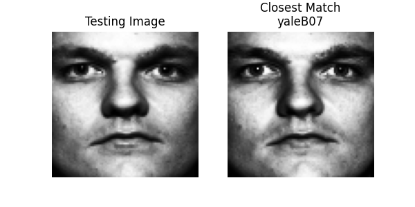
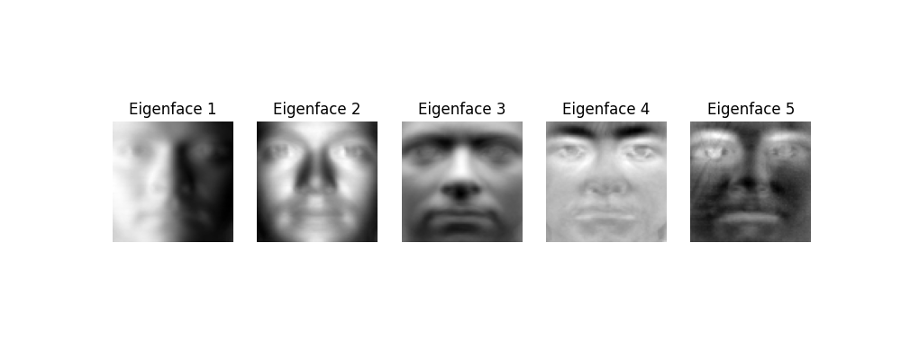

# Face Recognition Using Eigenfaces and PCA

A face recognition system implemented using the **Eigenfaces method** based on **Principal Component Analysis (PCA)**.

The project demonstrates dimensionality reduction, eigenface extraction, whitening, and face recognition using a linear subspace approach. The system is evaluated on the **Cropped Yale Face Dataset** and achieves **93.08% accuracy**.

---

## Features

- PCA-based dimensionality reduction
- Eigenface extraction
- Whitening in eigenface space
- Face projection and recognition
- Automatic threshold selection
- Euclidean distance-based matching

---

## Dataset

**Cropped Yale Face Dataset**

- 2,451 grayscale images
- 38 subjects
- Training set: 1,960 images
- Test set: 491 images

Images are resized to 80×80 pixels and preprocessed using histogram equalization and normalization.

---

## Results

| Metric | Value |
|---|---:|
| Accuracy | **93.08%** |
| Correct Predictions | 457 / 491 |
| Eigenfaces Used | 80 |
| Auto Threshold | 0.18158 |

Example recognition:

Input: testing.pgm
Prediction: yaleB07
Distance: 0.0725

## Visualization

### Recognition Result

The input image is matched with the closest face in the training set using Euclidean distance in the Eigenface space.

### Eigenfaces Visualization

The first five Eigenfaces extracted using PCA are shown below.

---

## Technologies

- Python
- NumPy
- OpenCV
- Matplotlib
- PCA
- Linear Algebra
- Computer Vision

---

## References

- Turk, M. & Pentland, A. *Eigenfaces for Recognition*, 1991.
- Belhumeur et al. *Eigenfaces vs. Fisherfaces*, IEEE TPAMI, 1997.

---

## Author

**Soheil Hemmat**
